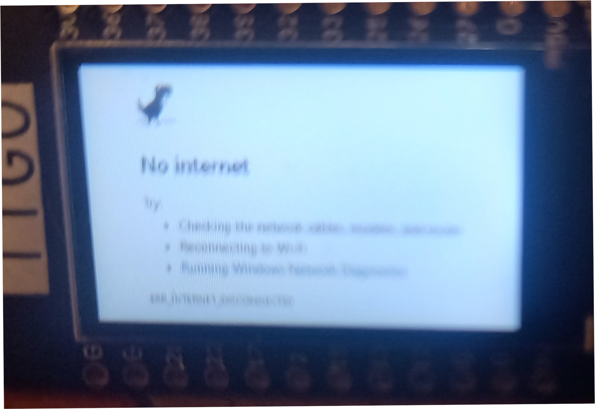
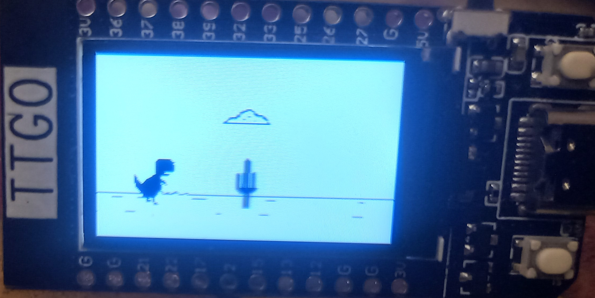

# TTGO - T-Rex game

A copy of the game originally programmed by [VelozR](https://github.com/VolosR/TRexTTGOdisplay). This is a clone of the Google 'no-internet' connection browser game. Updated the sprites and graphics and ready to be used in PlatformIO.

## Usage
Clone the repo, open it in [**PlatformIO**](https://platformio.org/) and flash it to the ESP32-TTGO-Display.

- Press the reset button on top to reset,
- Press the bottom button to start the game and jump,
- Press the upper button to modify the brightness of the display.

## Installing and running PlatformIO

- Install Visual Studio Code,
- From the Extensions menu select PlatformIO,
- Clone this repository, and open the folder in your workspace,
- Compile and upload to the ESP32-TTGO-Display,
- Enjoy!

## Credits
All the credits go to VelozR. See the original video on YouTube: [T-Rex game](https://www.youtube.com/watch?v=ilC4LIQZ77g).
